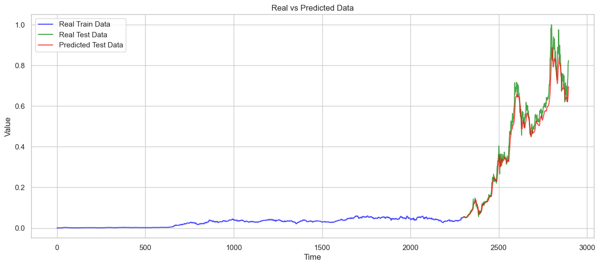

# Tesla Stock Prediction using LSTM

## Project Overview
This project aims to predict Tesla's stock prices using Long Short-Term Memory (LSTM) networks, a type of Recurrent Neural Network (RNN) designed for sequence prediction tasks. The model is trained on historical stock price data and can be used to predict future stock prices.

## Dataset
The dataset used for this project contains historical stock prices for Tesla, including features such as:
- Date
- Open Price
- High Price
- Low Price
- Close Price
- Volume

## Technologies Used
- Python
- TensorFlow (for LSTM model implementation)
- Pandas (for data manipulation)
- NumPy (for numerical calculations)
- Matplotlib (for data visualization)
- Scikit-learn (for data preprocessing)

## Model Description
- **Model Type:** Long Short-Term Memory (LSTM)
- **Input:** Historical stock price data (Open, High, Low, Close, Volume)
- **Output:** Predicted stock price (Close Price)
- **Evaluation Metric:** Mean Squared Error (MSE)

## Steps for Running the Project

## Results
The model predicts Tesla's stock price with a reasonable degree of accuracy. The results can be visualized with graphs showing the predicted vs. actual stock prices.

## Conclusion
This project demonstrates how to use LSTM networks for time-series forecasting, specifically for stock price prediction. Further improvements can include hyperparameter tuning, incorporating additional features, and exploring other deep learning models.
